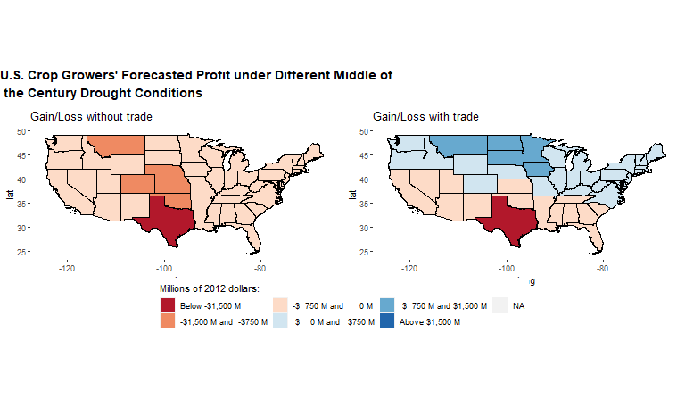
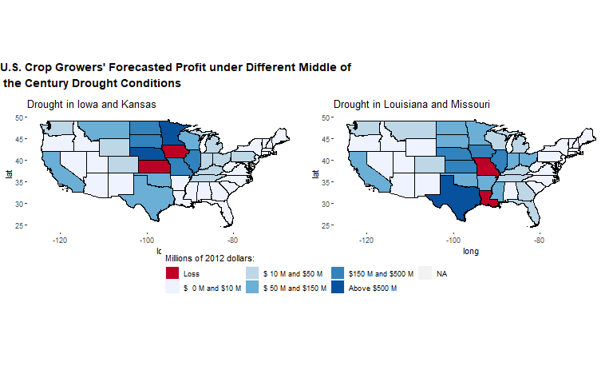

# ag_profits_sims repository

**Description**: This repository runs a couple of simulations (more upon request) based on Dall'Erba, Chen, Nava (2021): *U.S. interstate trade will mitigate the negative impact of climate change on crop profit* to illustrate how it is that trade can serve as a mitigating mechanism against climate change.

**Illustration**

In their work, the authors find that trade will serve as a mitigating mechanisms against climate change for crop growers in the U.S. To arrive to this conclusions, the authors recover parameters and statistics from 1) a gravity estimation, and 2) a *Ricardian approach* regression for agricultural profit. Then, the authors perform two forecasts using future climate conditions to predict future agricultural profits with and without trade. The map right below shows the simulation results at the state level. On the left hand side, the authors consider trade and on the right hand side the authors do not consider trade. Notice that the absence of trade all state will have experience agricultural profit losses, but once trade is accounted, not only the states all of the states are better off, but the Norther states seem to benefit from climate change.  

Gains and losses are substantial. For the case of IL, the state would lose about \$750 millions, but because of its ability to trade with other U.S. states, IL future climate conditions will lead to additional of up to \$750 millions. 

The paper provides empirical evidence about the role of trade in affecting agricultural profits. Here, I provide simulation results to illustrate the authors' argument, using their own data: Figure right below. The counterfactual studied here focus on IL trade competitors (Iowa and Kansas) on the left panel, and IL main importers (Louisiana and Missouri) on the right panel. On the left panel, Iowa and Kansas experience drought conditions to the middle of the century, which in turn will affect trade patterns and prices. Thus, the rest of the U.S. will benefit from Iowa and Kansas drought conditions, bringing between \$150 to \$500 million dollars of additional income to IL. In a similar fashion, IL benefits from droughts in Louisiana and Missouri.

All mistakes are my own.

**References and suggested citation:**

Dall'Erba Sandy, Chen Zhangliang, Nava Noé J. 2021. *U.S. interstate trade will mitigate the negative impact of climate change on crop profit*, **American Journal of Agricultural Economics** 00(00): 1-22.

